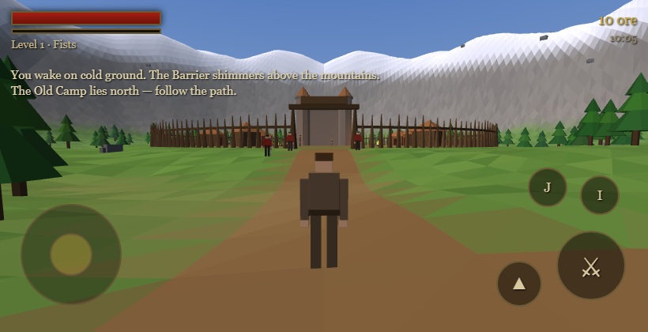
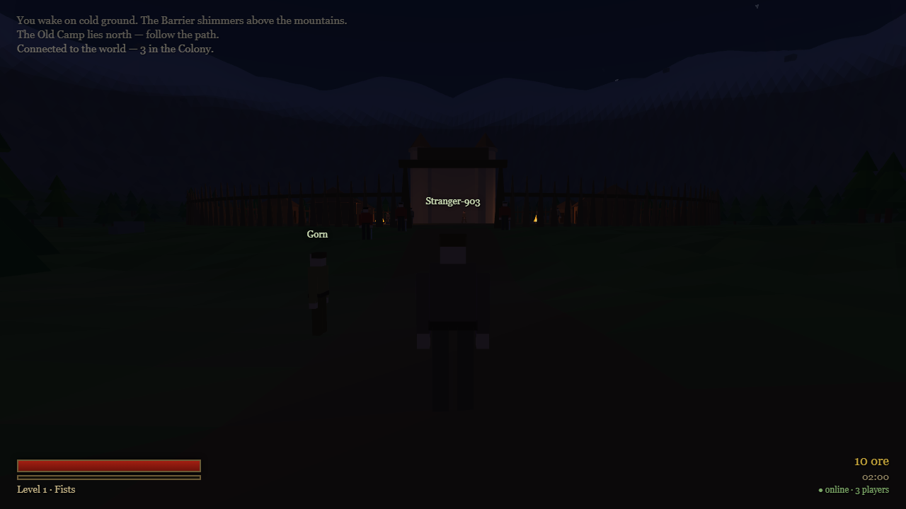

# GOTHIC — a browser homage, from scratch

A small playable recreation of the opening of *Gothic* (Piranha Bytes, 2001), running
entirely in the browser. No engine, no libraries, no build step — a hand-written WebGL2
renderer and game in plain JavaScript.


## Run it

Open `index.html` in any modern browser (Chrome, Edge, Firefox). That's it — it works
straight from the file system, no server needed.

Useful URL parameters:

- `index.html?demo` — skips the title screen (used for screenshots/testing)
- `index.html?demo&time=0.97` — also forces the time of day (0..1, 0.5 = noon)
- `index.html?autotest` — runs the automated gameplay smoke test and prints PASS/FAIL

## What's in the Colony

- **The valley** — procedural terrain ringed by snow-capped mountains, with the
  shimmering magic **Barrier** dome closing it off (it physically throws you back).
- **The Old Camp** — palisade ring with a south gate, diggers' huts, the ore barons'
  castle keep, campfires that act as real light sources at night.
- **People** — Diego at the gate (quest giver), gate guards, Whistler the trader,
  Snaf the cook, wandering diggers — each with dialogue.
- **A quest** — clear five molerats from the old mine path for 50 ore and a blade.
- **Combat** — melee swings with timing, aggro/chase/leash AI, XP and level-ups.
- **Hostiles** — molerats on the mine path, bandits at the ruined watchtower (NE).
- **Systems** — inventory with food healing, ore currency, trading, journal,
  day/night cycle with sun, moon, stars and fog, a lake, death & respawn.

## Controls

Desktop:

| Key | Action |
|---|---|
| WASD | Move (Shift to walk) |
| Mouse | Look (click to capture the cursor) |
| Left click | Attack |
| Space | Jump |
| E | Talk |
| I | Inventory |
| J | Journal |
| C | Character screen |
| Esc | Close panel / release cursor |

Mobile (auto-detected when the primary pointer is touch; force with `?touch`):



- Left thumb stick: move (analog — push gently to walk)
- Drag anywhere on the world: look around
- ⚔ attack · ▲ jump (hold) · I inventory · J journal · C character
- Tap the on-screen prompt to talk to people

## Multiplayer



One server, n players, one persistent world. The static game stays on Netlify (or
any static host); `server.js` runs separately — it's a zero-dependency Node script
(the WebSocket protocol is implemented by hand, no npm install needed).

The server owns world time (saved to `world.json`, so it survives restarts) and all
hostile NPCs: their AI, deaths and **respawns** (molerats 60s, bandits 120s). Hits
are validated server-side. There is no PvP — players cannot hurt each other, and
camp folk can never be killed. Player progress (level, ore, quest) is saved per
browser in localStorage; add `?reset` to the URL to start over.

Run it:

```
node server.js          # listens on $PORT or 8080
```

Point clients at it (any of these):

- `https://your-game.netlify.app/?server=wss://your-server.example.com` (remembered)
- set `DEFAULT_SERVER` at the top of `js/net.js` and redeploy — then plain visits connect
- opened locally (file:// or localhost) it auto-tries `ws://localhost:8080`

If no server answers, the game silently runs single-player (hostiles still respawn).

Hosting the server for free: create a GitHub repo containing `server.js`, then on
[render.com](https://render.com) make a **Web Service** from it — runtime Node,
start command `node server.js`. Render sets `$PORT` automatically and gives you
`wss://your-name.onrender.com`. (Free instances sleep when idle; the first visitor
wakes them in ~30 s.) Any always-on box with Node works the same.

`tools/bot.js` is a headless test player: `node tools/bot.js localhost 8080 Gorn`.

## How it's built

| File | Role |
|---|---|
| `js/math3d.js` | Column-major mat4/vec3 math, seeded PRNG |
| `js/engine.js` | WebGL2 setup, GLSL shaders (lit/sky/water/barrier/flames), mesh builders |
| `js/world.js` | Terrain function + colors, Old Camp, forest, lake, mine, ruin, colliders |
| `js/character.js` | Articulated humans & molerats posed from a single unit cube |
| `js/game.js` | Player physics, NPC AI, combat, quests, items, dialogue trees |
| `js/ui.js` | HUD, dialogue box, inventory, journal, death screen |
| `js/main.js` | Input, third-person camera, day/night lighting, render loop |
| `js/touch.js` | Mobile controls: virtual joystick, drag-to-look, action buttons |
| `js/net.js` | Multiplayer client: remote players, server-driven hostiles, saves |
| `server.js` | World server: hand-rolled WebSockets, hostile AI, respawns, persistence |
| `tools/bot.js` | Headless test player for the server |
| `js/test.js` | In-page gameplay smoke test (`?autotest`) |

Everything is flat-shaded low-poly geometry generated at load time; characters are
hierarchies of tinted unit cubes; the palisade ring collides analytically. All
content is original work inspired by the setting — no assets or code from the game.
